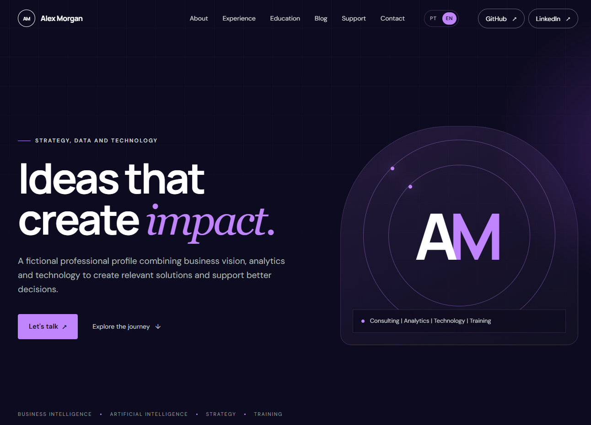

# Violet Insight Personal Site

[](https://developer.mozilla.org/en-US/docs/Web/HTML)
[](https://developer.mozilla.org/en-US/docs/Web/CSS)
[](https://developer.mozilla.org/en-US/docs/Web/JavaScript)
[](https://pages.github.com/)
[](LICENSE)

A professional, bilingual personal website template for GitHub Pages. It includes a landing page, profile, focus areas, experience, education and research, contact links, and a static blog that points to external articles.



## Features

- Portuguese and English versions
- Responsive layout
- Static external-link blog
- Accessible navigation and subtle scroll animations
- No build process or dependencies
- Ready for GitHub Pages

## Customise

1. Replace `Alex Morgan`, `AM`, and the demonstration copy in `index.html` and `en/index.html`.
2. Replace `your-username` and `your-profile` in all HTML files.
3. Replace `your-page` with your Buy Me a Coffee page, or remove the support section.
4. Add blog entries to `blog/index.html` and `en/blog/index.html` by copying an existing `post-card` article.
5. Adjust the violet palette in `palette.css`.
6. Replace the favicon files in `assets/`.

## Preview locally

Open `index.html` directly in a browser, or run a simple local HTTP server:

```bash
python -m http.server 8000
```

Then open `http://localhost:8000`.

## Publish with GitHub Pages

Create a GitHub repository, push these files to the `main` branch, and enable Pages under **Settings → Pages** using **Deploy from a branch** and the repository root.

## License

This template is released under the [MIT License](LICENSE). You may use, copy,
modify, merge, publish and distribute it for personal or commercial projects,
provided that the original copyright and license notice are retained.
