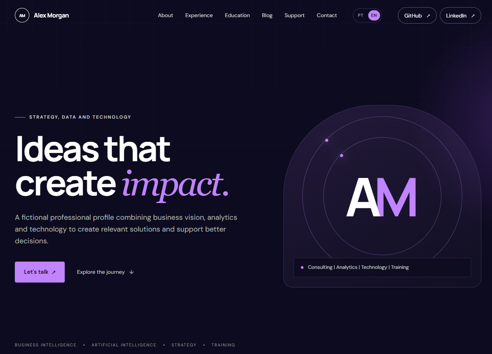

<div align="center">

# Violet Insight Personal Site

### A modern, bilingual personal website template for GitHub Pages

[](https://developer.mozilla.org/en-US/docs/Web/HTML)
[](https://developer.mozilla.org/en-US/docs/Web/CSS)
[](https://developer.mozilla.org/en-US/docs/Web/JavaScript)
[](https://pages.github.com/)
[](LICENSE)

**Responsive · Bilingual · Static · No build process**

</div>

---

## About

**Violet Insight Personal Site** is a lightweight, bilingual personal website template designed for professionals, researchers, educators, and technology enthusiasts who want a clean online presence hosted directly on GitHub Pages.

The site combines a professional landing page, profile and career information, areas of interest, education and research, contact links, and a static blog for linking to external articles and publications.



---

## Highlights

- Portuguese and English versions
- Responsive layout for desktop and mobile devices
- Professional profile and career sections
- Education, research, and areas of interest
- Static blog for external articles and publications
- Accessible navigation and subtle scroll animations
- No framework, build process, or external dependencies
- Ready for deployment with GitHub Pages
- Simple structure that is easy to customise

---

## Technology Stack

| Technology | Purpose |
| --- | --- |
| **HTML5** | Page structure and semantic content |
| **CSS3** | Layout, responsive design, and visual styling |
| **JavaScript** | Lightweight interactions and animations |
| **GitHub Pages** | Static website hosting and deployment |

The project intentionally avoids front-end frameworks and build tooling, keeping the site portable and straightforward to maintain.

---

## Website Structure

The template provides dedicated areas for:

- Landing page and professional introduction
- Profile and focus areas
- Professional experience
- Education and research
- Credentials and qualifications
- Contact and external profiles
- Blog and external publications
- Portuguese and English content

---

## Project Structure

```text
violet-insight-personal-site/
├── assets/             # Images, favicons and visual assets
├── blog/               # Portuguese blog pages
├── en/                 # English version of the website
├── index.html          # Portuguese landing page
├── script.js           # Client-side interactions
├── style.css           # Main styles
├── palette.css         # Colour palette
├── profile.css         # Profile-specific styles
├── credentials.css     # Credentials-specific styles
├── blog.css            # Blog-specific styles
├── language.css        # Language selector styles
├── finishing.css       # Additional visual refinements
├── LICENSE
└── README.md
```

---

## Customisation

To adapt the template to your own profile:

1. Replace the demonstration name, initials, and profile copy in `index.html` and `en/index.html`.
2. Update the GitHub, LinkedIn, and other external profile links in the HTML files.
3. Replace or remove the support link according to your needs.
4. Add blog entries to `blog/index.html` and `en/blog/index.html` by following the existing article structure.
5. Adjust the violet colour palette in `palette.css`.
6. Replace the images and favicon files in `assets/`.

---

## Run Locally

No installation or build step is required.

You can open `index.html` directly in a browser or start a simple local HTTP server:

```bash
python -m http.server 8000
```

Then open `http://localhost:8000` in your browser.

---

## Deployment

The project is designed for **GitHub Pages**.

1. Push the repository to GitHub.
2. Open **Settings → Pages**.
3. Select **Deploy from a branch**.
4. Choose the `main` branch and the repository root.
5. Save the configuration and wait for GitHub Pages to publish the site.

---

## Use Cases

This template can be used as a starting point for:

- Personal professional websites
- Academic and research profiles
- Developer portfolios
- Online CVs and résumés
- Personal blogs linking to external publications
- GitHub Pages profile sites

---

## License

This project is released under the [MIT License](LICENSE).

Copyright © 2026 Violet Insight contributors.
